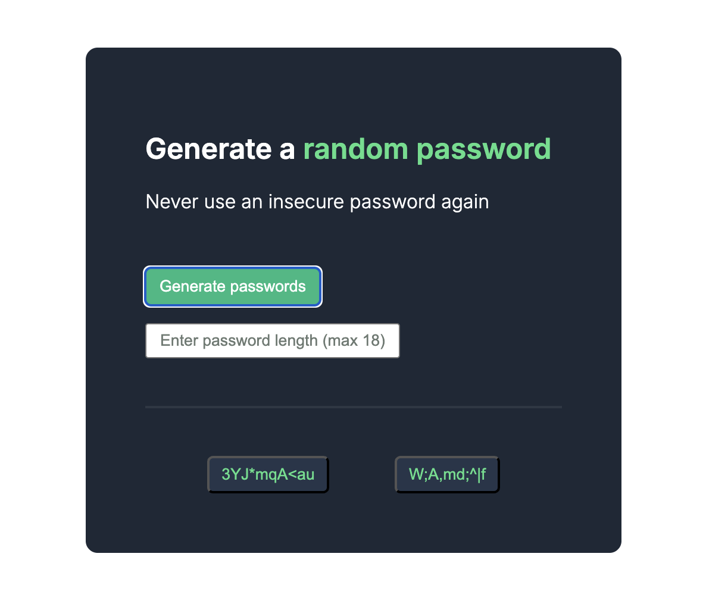

# Solo project - Password Generator

# Features:
- Ability to set password length (max 18, default 8)
- Copy on click

# Practiced/Learned:
- CSS: margin, padding, flexbox, centering
- HTML: hr = horizontal line, input (text), div, hidden buttons
- JS: getting input value, copying text, using randomness, unhiding buttons
- Functions using "this" -> clicking a button and using its text

